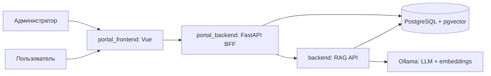
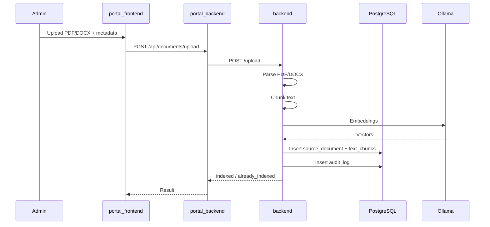
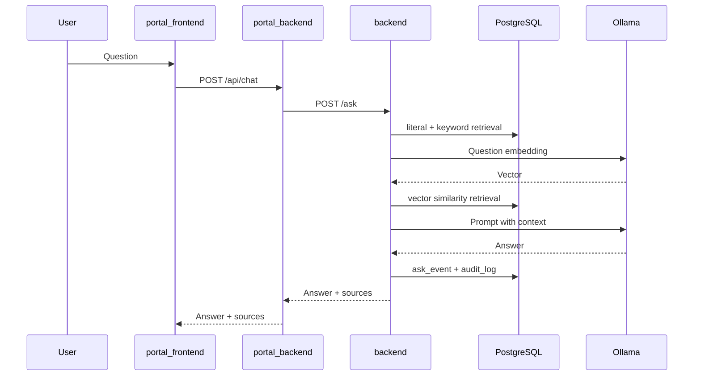

# Контекст проекта BKI System

Этот файл дает цельную карту проекта: что он делает, из каких частей состоит, где искать ключевую логику, как проходят основные сценарии и как запускать систему локально. Его задача - быстро восстановить контекст происходящего без необходимости заново обходить весь репозиторий.

## 1. Назначение проекта

Проект реализует локальную RAG-систему для работы с документами:

- администратор загружает PDF/DOCX-документы;
- система извлекает текст, режет его на чанки, строит embeddings через Ollama и сохраняет их в PostgreSQL с pgvector;
- пользователь задает вопросы в чате или через API;
- backend ищет релевантные фрагменты документов через точный, полнотекстовый и векторный поиск;
- LLM формирует ответ только на основе найденного контекста;
- ответы сопровождаются источниками, а запросы и действия пишутся в аудит.

Система ориентирована на on-premise запуск: база, LLM, API и веб-портал поднимаются через Docker Compose.

## 2. Верхнеуровневая архитектура



Основные сервисы из `docker-compose.yml`:

- `db` - PostgreSQL 16 с расширением pgvector.
- `ollama` - локальный сервер моделей.
- `app` - основной FastAPI backend на порту `8000`.
- `portal-api` - portal/BFF FastAPI backend на порту `8001`.
- `portal-web` - Vue-приложение через nginx на порту `8080`.

## 3. Структура репозитория

```text
bki_system/
  backend/              основной RAG API: загрузка, индексация, поиск, LLM, аудит
  portal_backend/       BFF API для веб-портала, проксирует чат/загрузку в backend
  portal_frontend/      Vue 3 интерфейс портала
  schema/               SQL-схема PostgreSQL и pgvector
  docs/                 документация, диаграммы, отчеты
  scripts/              утилиты генерации, загрузки и оценки eval-корпуса
  tests/                pytest-тесты backend/RAG-логики
  eval_corpus/          тестовые документы и QA-набор для оценки
  analysis/             JSON-результаты прогонов оценки
  docker-compose.yml    локальная инфраструктура проекта
```

## 4. Основной backend: `backend`

Папка `backend` содержит главное приложение RAG API.

Ключевые файлы:

- `backend/app/main.py` - создание FastAPI-приложения, подключение роутеров, bootstrap admin, добавление недостающих колонок metadata.
- `backend/app/config.py` - настройки БД, Ollama, JWT, моделей, chunking, self-correction.
- `backend/app/api/routes/upload.py` - загрузка PDF/DOCX, парсинг, chunking, embeddings, запись документов и чанков.
- `backend/app/api/routes/ask.py` - endpoint вопрос-ответ, аудит, получение последних использованных чанков.
- `backend/app/api/routes/auth.py` - авторизация и JWT.
- `backend/app/api/routes/feedback.py` - обратная связь по ответам.
- `backend/app/api/routes/health.py` - healthcheck.
- `backend/app/api/routes/tester_ui.py` - встроенный тестовый UI/вспомогательный интерфейс.
- `backend/app/rag/orchestrator.py` - главный сценарий RAG: retrieval, prompt, LLM, optional verification.
- `backend/app/rag/retrieval.py` - literal search, keyword search, vector similarity search.
- `backend/app/rag/prompts.py` - system/user prompts и режимы ответа.
- `backend/app/rag/llm.py` - подключение к Ollama/chat model.
- `backend/app/ingest/parser_pdf.py` - извлечение текста из PDF.
- `backend/app/ingest/parser_docx.py` - извлечение текста из DOCX.
- `backend/app/ingest/chunking.py` - очистка текста и разбиение страниц на чанки.
- `backend/app/ingest/embedder.py` - получение embeddings через Ollama.
- `backend/app/db/models.py` - SQLAlchemy-модели таблиц.
- `backend/app/db/session.py` - async SQLAlchemy session.
- `backend/app/security/jwt.py` - JWT, hashing, Actor.
- `backend/app/security/rbac.py` - проверки ролей `user`/`admin`.
- `backend/app/security/redaction.py` - редактирование чувствительных данных перед аудитом.
- `backend/app/documents/categories.py` - нормализация и фильтрация категорий документов.

### Что делает backend при загрузке документа

Endpoint: `POST /upload`, нужен JWT с ролью `admin`.

Поток:

1. Принимает файл `.pdf` или `.docx` и metadata: `doc_year`, `doc_category`, `description`, `is_active`.
2. Читает файл в память.
3. Считает SHA-256 и проверяет, не был ли документ уже загружен.
4. Извлекает страницы через `extract_pdf_pages` или `extract_docx_pages`.
5. Чистит и режет текст через `chunk_pages`.
6. Получает embeddings пачками через `embed_texts`.
7. Создает запись в `source_documents`.
8. Создает записи в `text_chunks`.
9. Пишет событие в `audit_log`.

### Что делает backend при вопросе

Endpoint: `POST /ask`, нужен JWT с ролью `user` или `admin`.

Поток:

1. Принимает вопрос, фильтры и режим ответа.
2. Редактирует вопрос для аудита через `redact_text`.
3. Вызывает `answer_question`.
4. Retrieval ищет чанки тремя способами:
   - `literal_search` - точное вхождение значимых терминов;
   - `keyword_search` - PostgreSQL full-text search по `search_vector`;
   - `similarity_search` - cosine distance по pgvector.
5. `merge_retrieved_chunks` объединяет результаты, отдавая приоритет точным совпадениям.
6. Prompt строится в `build_user_prompt`.
7. LLM вызывается через Ollama.
8. Если `ENABLE_SELF_CORRECTION=true`, отдельная модель-проверяющий оценивает поддержку ответа контекстом.
9. Ответ, источники и audit payload сохраняются в БД.

## 5. Portal backend: `portal_backend`

`portal_backend` - это backend-for-frontend слой для Vue-портала. Он работает на порту `8001`, общается с основной RAG API через `APP_API_URL`, а также читает документы напрямую из общей БД.

Ключевые файлы:

- `portal_backend/app/main.py` - создание FastAPI-приложения и подключение portal routes.
- `portal_backend/app/config.py` - настройки БД, JWT, URL основного backend.
- `portal_backend/app/api/routes/auth.py` - login/auth для портала.
- `portal_backend/app/api/routes/chat.py` - `/api/chat`, проксирует запросы в `backend /ask`.
- `portal_backend/app/api/routes/documents.py` - список документов, просмотр, поиск, загрузка, изменение metadata/status/categories, удаление.
- `portal_backend/app/api/routes/health.py` - healthcheck.
- `portal_backend/app/clients/app_api.py` - HTTP-клиент к основному backend.
- `portal_backend/app/db/models.py` - модели для чтения общей БД.
- `portal_backend/app/security/jwt.py` - авторизация портала.

Portal backend нужен, чтобы frontend не ходил напрямую в два разных внутренних сервиса и чтобы иметь удобный `/api/...` слой для UI.

## 6. Frontend: `portal_frontend`

Frontend написан на Vue 3 + Vue Router + Vite.

Ключевые файлы:

- `portal_frontend/package.json` - зависимости и npm scripts.
- `portal_frontend/vite.config.js` - Vite-конфигурация.
- `portal_frontend/nginx.conf` - конфигурация nginx для docker-сборки.
- `portal_frontend/src/main.js` - входная точка Vue.
- `portal_frontend/src/App.vue` - общий каркас приложения.
- `portal_frontend/src/router.js` - маршруты приложения.
- `portal_frontend/src/pages/ChatPage.vue` - чат с RAG-ассистентом.
- `portal_frontend/src/pages/DocumentViewerPage.vue` - просмотр и поиск документов.
- `portal_frontend/src/pages/AdminDocumentsPage.vue` - администрирование документов.

Маршруты:

- `/` - чат.
- `/documents` - просмотр документов.
- `/admin/documents` - админская страница документов.

## 7. База данных

Схема находится в `schema/01_init.sql` и автоматически применяется контейнером PostgreSQL при первом создании volume.

Основные расширения:

- `pgcrypto` - UUID через `gen_random_uuid`.
- `vector` - pgvector embeddings.

Основные таблицы:

- `roles` - роли пользователей.
- `users` - пользователи.
- `user_roles` - связь пользователей и ролей.
- `source_documents` - metadata загруженных документов.
- `text_chunks` - текстовые чанки и embeddings.
- `ask_events` - события вопросов.
- `feedback` - оценки ответов.
- `audit_log` - append-only аудит действий.

Индексы:

- `text_chunks_doc_year_idx` - фильтрация по году.
- `text_chunks_doc_category_idx` - фильтрация по категории.
- `text_chunks_search_vector_gin_idx` - полнотекстовый поиск.
- `text_chunks_embedding_hnsw_idx` - HNSW индекс pgvector для cosine similarity.
- `source_documents_active_year_idx` - активные документы по году.

Важно: размерность embeddings зафиксирована как `vector(768)`, что соответствует модели `nomic-embed-text` по умолчанию.

## 8. API основного backend

Базовый адрес при Docker Compose: `http://localhost:8000`.

Основные endpoints:

- `GET /healthz` - проверка состояния.
- `POST /auth/login` - login, возвращает JWT.
- `POST /admin/bootstrap` - bootstrap admin, требует admin JWT.
- `POST /upload` - загрузка PDF/DOCX, требует admin JWT.
- `POST /ask` - RAG-вопрос, требует user/admin JWT.
- `GET /ask/last-chunks` - последние чанки, использованные в вопросе текущего пользователя.
- `POST /feedback` - оценка ответа.

Подробная документация уже есть в `docs/api.md`.

## 9. API portal backend

Базовый адрес при Docker Compose: `http://localhost:8001`.

Основные endpoints:

- `GET /healthz` - проверка состояния.
- `POST /api/auth/login` - login для портала.
- `POST /api/chat` - чат, проксирует в основной `/ask`.
- `GET /api/documents` - список документов с фильтрами.
- `GET /api/documents/{document_id}` - детальная карточка документа.
- `GET /api/documents/{document_id}/search` - поиск внутри документа.
- `POST /api/documents/upload` - загрузка документа через портал.
- `PATCH /api/documents/{document_id}/status` - включение/отключение документа.
- `PATCH /api/documents/{document_id}/metadata` - изменение имени, описания, года.
- `PATCH /api/documents/{document_id}/categories` - изменение категорий.
- `DELETE /api/documents/{document_id}` - удаление документа.

## 10. Переменные окружения

Ключевые переменные из `docker-compose.yml` и config-файлов:

### База данных

- `POSTGRES_DB` - имя БД, default `bki`.
- `POSTGRES_USER` - пользователь, default `postgres`.
- `POSTGRES_PASSWORD` - пароль, default `postgres`.
- `POSTGRES_HOST` - host БД внутри Docker, default `db`.
- `POSTGRES_PORT` - порт, default `5432`.

### Ollama и модели

- `OLLAMA_BASE_URL` - адрес Ollama, default `http://ollama:11434`.
- `EMBEDDING_MODEL` - модель embeddings, default `nomic-embed-text`.
- `EMBEDDING_DIM` - размерность embeddings, default `768`.
- `LLM_MODEL` - основная LLM, default `qwen2.5:7b`.
- `VERIFIER_LLM_MODEL` - модель-проверяющий, default в compose `qwen2.5:3b`.
- `LLM_NUM_CTX` - контекст LLM, default `4096`.
- `LLM_NUM_PREDICT` - лимит генерации, default `512`.
- `LLM_KEEP_ALIVE` - keep-alive модели, default `10m`.
- `ENABLE_SELF_CORRECTION` - включить проверку ответа, default `false`.

### Auth/JWT

- `AUTH_MODE` - режим авторизации, default `hybrid`.
- `JWT_SECRET` - секрет основного backend.
- `JWT_ALGORITHM` - default `HS256`.
- `ADMIN_USERNAME` - bootstrap admin username.
- `ADMIN_PASSWORD` - bootstrap admin password.
- `ENABLE_BOOTSTRAP_ADMIN` - создавать admin при старте.
- `PORTAL_JWT_SECRET` - секрет portal JWT.
- `PORTAL_JWT_ALGORITHM` - default `HS256`.
- `PORTAL_JWT_ISSUER`, `PORTAL_JWT_AUDIENCE` - optional claims validation.
- `PORTAL_SUB_CLAIM`, `PORTAL_USERNAME_CLAIM`, `PORTAL_ROLES_CLAIM` - names of claims for portal tokens.
- `PORTAL_AUTO_PROVISION_USERS` - автосоздание пользователей из portal JWT.

### Chunking

- `CHUNK_SIZE` - размер чанка, default `1000`.
- `CHUNK_OVERLAP` - overlap чанков, default `150`.
- `EMBED_BATCH_SIZE` - размер пачки embeddings при upload, default `64`.

## 11. Как запустить проект

Из корня репозитория:

```powershell
docker compose up --build
```

После запуска:

- Web UI: `http://localhost:8080`
- Main backend API: `http://localhost:8000`
- Portal backend API: `http://localhost:8001`

Проверка health:

```powershell
curl http://localhost:8000/healthz
curl http://localhost:8001/healthz
```

Если volume БД уже создан, `schema/01_init.sql` не будет применяться заново автоматически. Для полного пересоздания БД нужно осознанно удалить Docker volume `db_data`.

## 12. Модели Ollama

По умолчанию проект ожидает:

- embeddings: `nomic-embed-text`;
- LLM: `qwen2.5:7b`;
- verifier LLM: `qwen2.5:3b`.

Перед полноценной работой модели должны быть загружены в контейнер Ollama. Типовая команда внутри окружения:

```powershell
docker compose exec ollama ollama pull nomic-embed-text
docker compose exec ollama ollama pull qwen2.5:7b
docker compose exec ollama ollama pull qwen2.5:3b
```

Если модели не загружены, `/ask` может вернуть ошибку доступности модели.

## 13. Пользовательские роли

Есть две базовые роли:

- `user` - может задавать вопросы и просматривать документы.
- `admin` - может загружать, изменять и удалять документы.

При старте `backend/app/main.py` может создать bootstrap admin, если `ENABLE_BOOTSTRAP_ADMIN=true`.

В Docker Compose default admin:

- username: `admin`
- password: `admin`

В `backend/app/config.py` standalone default отличается: `admin_password_change_me`. При запуске через Compose применяются значения из `docker-compose.yml`.

## 14. Документы и категории

Документы хранятся в таблице `source_documents`.

Metadata:

- `file_name` - имя файла.
- `file_hash` - SHA-256, используется для дедупликации.
- `description` - описание.
- `doc_year` - год документа.
- `doc_category` - нормализованные категории.
- `is_active` - участвует ли документ в retrieval.
- `uploaded_by` - кто загрузил.

Категории нормализуются в `backend/app/documents/categories.py` и `portal_backend/app/documents/categories.py`. Retrieval учитывает категории через `category_membership_condition`.

## 15. Retrieval и качество ответов

Retrieval находится в `backend/app/rag/retrieval.py`.

Поиск комбинированный:

- literal search хорошо ловит точные термины, идентификаторы, коды, номера и редкие слова;
- keyword search использует `websearch_to_tsquery('russian', ...)` и GIN index;
- semantic search строит embedding вопроса и ищет ближайшие чанки по cosine distance.

Слияние результатов находится в `merge_retrieved_chunks`:

- сначала учитываются literal/keyword совпадения;
- затем добавляется semantic recall;
- дубликаты по `chunk_id` удаляются;
- итог ограничивается `top_k`.

Если чанки не найдены, ответом становится:

```text
Insufficient information to answer.
```

## 16. Аудит и безопасность

Проект сохраняет действия в `audit_log`:

- загрузка документа;
- вопрос к RAG;
- redacted payload;
- статус операции;
- `request_id`;
- actor user id.

Перед записью вопросов и имен файлов используется `redact_text`.

RBAC реализован через зависимости:

- `user_required`;
- `admin_required`.

JWT-логика находится в:

- `backend/app/security/jwt.py`;
- `portal_backend/app/security/jwt.py`.

## 17. Тесты

Тесты находятся в `tests/`.

Существующие направления тестирования:

- `test_chunking.py` - chunking.
- `test_retrieval.py` - retrieval.
- `test_orchestrator.py` - orchestration.
- `test_prompts.py` - prompts.
- `test_redaction.py` - redaction.
- `test_ask_document_scope.py` - ограничения по документу.
- `test_ask_last_chunks.py` - последние чанки вопроса.
- `test_chat_prompt_routing.py` - сборка chat prompt/history.
- `test_evaluate_validation.py` - validation evaluation.
- `test_ollama_model_check.py` - проверка доступности модели.

Обычный запуск:

```powershell
pytest
```

Если тесты запускаются вне Docker, может понадобиться корректный `PYTHONPATH` и доступные зависимости из `backend/requirements.txt`.

## 18. Evaluation corpus и scripts

Папка `eval_corpus/` содержит:

- `documents/` - тестовые DOCX-документы;
- `qa_set.jsonl` - вопросы/ответы для оценки;
- `manifest.json` - manifest корпуса.

Папка `scripts/` содержит:

- `generate_eval_corpus.py` - генерация eval-корпуса.
- `upload_eval_corpus.py` - загрузка eval-документов в систему.
- `evaluate.py` - запуск оценки.
- `evaluation_metrics.py` - метрики оценки.

Папка `analysis/` содержит JSON-результаты прогонов evaluation.

## 19. Существующая документация

В `docs/` уже есть:

- `docs/api.md` - описание основного API.
- `docs/evaluation.md` - документация по оценке.
- `docs/diploma_ai.md` - AI/RAG часть дипломной документации.
- `docs/diploma_web.md` - web часть.
- `docs/diploma_report.md` - отчет.
- `docs/intelligent_service_work_report.md` - рабочий отчет.
- `docs/diagrams/*.mmd` - Mermaid-диаграммы.

Этот файл не заменяет специализированные документы, а служит общей картой.

## 20. Диаграммы процессов

### Загрузка документа



### Вопрос в чате



## 21. Где менять типовые вещи

### Изменить prompt

Файл:

```text
backend/app/rag/prompts.py
```

Что смотреть:

- `system_prompt_russian`;
- `ANSWER_MODE_INSTRUCTIONS`;
- `build_user_prompt`.

### Изменить стратегию retrieval

Файлы:

```text
backend/app/rag/retrieval.py
backend/app/rag/orchestrator.py
```

Что смотреть:

- `literal_search`;
- `keyword_search`;
- `similarity_search`;
- `merge_retrieved_chunks`;
- `retrieve_relevant_chunks`.

### Изменить upload/индексацию

Файлы:

```text
backend/app/api/routes/upload.py
backend/app/ingest/chunking.py
backend/app/ingest/parser_pdf.py
backend/app/ingest/parser_docx.py
backend/app/ingest/embedder.py
```

### Изменить структуру БД

Файлы:

```text
schema/01_init.sql
backend/app/db/models.py
portal_backend/app/db/models.py
```

Важно синхронизировать SQL-схему и обе копии SQLAlchemy-моделей.

### Изменить UI

Файлы:

```text
portal_frontend/src/App.vue
portal_frontend/src/router.js
portal_frontend/src/pages/ChatPage.vue
portal_frontend/src/pages/DocumentViewerPage.vue
portal_frontend/src/pages/AdminDocumentsPage.vue
```

### Изменить portal API

Файлы:

```text
portal_backend/app/api/routes/chat.py
portal_backend/app/api/routes/documents.py
portal_backend/app/clients/app_api.py
```

### Изменить auth/RBAC

Файлы:

```text
backend/app/security/jwt.py
backend/app/security/rbac.py
portal_backend/app/security/jwt.py
```

## 22. Известные особенности кода

- В некоторых Python-файлах русские строки выглядят как mojibake, например `Рџ...`. Это похоже на проблему кодировки при сохранении или отображении. Логика может работать, но текст prompt/UI/API-сообщений стоит проверить и при необходимости восстановить в UTF-8.
- В корне есть папки `pytest-cache-files-*`, к которым текущая среда может не иметь доступа. Это не часть основной логики проекта.
- В `analysis/` есть несколько untracked JSON-файлов с результатами оценки.
- `backend/app/main.py` и `portal_backend/app/main.py` на startup добавляют колонки `description` и `uploaded_by`, если их нет. Это совместимость со старой схемой, но долгосрочно лучше держать миграции явно.

## 23. Быстрый onboarding-сценарий

1. Поднять систему:

```powershell
docker compose up --build
```

2. Убедиться, что API живы:

```powershell
curl http://localhost:8000/healthz
curl http://localhost:8001/healthz
```

3. Проверить/загрузить модели Ollama:

```powershell
docker compose exec ollama ollama pull nomic-embed-text
docker compose exec ollama ollama pull qwen2.5:7b
```

4. Открыть портал:

```text
http://localhost:8080
```

5. Войти admin/admin, если используются default значения из `docker-compose.yml`.

6. Загрузить документы через `/admin/documents`.

7. Задать вопросы через `/`.

8. Проверять источники и использованные chunks через UI или endpoint `/ask/last-chunks`.

## 24. Ментальная модель проекта

Проект можно держать в голове как три слоя:

1. `backend` - мозг RAG: документы, embeddings, retrieval, prompt, LLM, аудит.
2. `portal_backend` - фасад для UI: auth, chat proxy, document management API.
3. `portal_frontend` - рабочее место пользователя и администратора.

Все важные данные живут в PostgreSQL:

- исходные файлы как бинарники не сохраняются;
- сохраняются metadata документов;
- сохраняются чанки текста;
- сохраняются embeddings;
- сохраняется история вопросов, источников и аудита.

Ollama является внешним вычислительным компонентом для:

- embeddings при индексации и вопросах;
- генерации ответа;
- optional self-correction.

